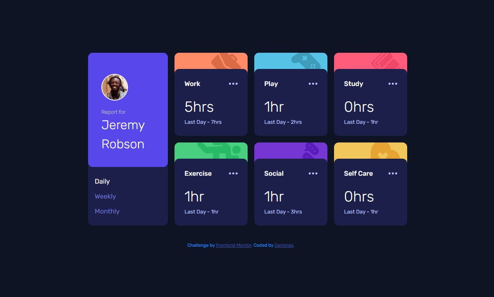

# Frontend Mentor - Time tracking dashboard

## Table of contents

- [Overview](#overview)
  - [The challenge](#the-challenge)
  - [Screenshot](#screenshot)
  - [Links](#links)
- [My process](#my-process)
  - [Built with](#built-with)
  - [What I learned](#what-i-learned)
  - [Continued development](#continued-development)
  - [Useful resources](#useful-resources)
- [Author](#author)
- [Acknowledgments](#acknowledgments)

## Overview

### The challenge

Users should be able to:

- View the optimal layout for the site depending on their device's screen size
- See hover states for all interactive elements on the page
- Switch between viewing Daily, Weekly, and Monthly stats

### Screenshot

### Links

- Solution URL: [Time tracking dashboard solution](https://github.com/Darionas/time-tracking-dashboard)
- Live Site URL: [Time tracking dashboard live site](https://darionas.github.io/time-tracking-dashboard/)

## My process

### Built with

- Semantic HTML5 markup
- CSS custom properties
- Flexbox
- CSS Grid
- Mobile-first workflow
- TypeScript

### Used techniques:

- BEM
- Accessibility

But created with :heart:

### What I learned

I have taken TypeScript course and I have used it on this challenge. It was a new experience for me. Data was fetched from JSON file and time tracking dashboard was populated dynamically.

### Continued development

- Start learning Figma.

### Useful resources

- [TypeScript course](https://www.youtube.com/watch?v=yba10v2F5TI&list=PL1BztTYDF-QNrddrcvejiw5vxSZSPIRfn) - Easy to learn, with live examples.
- [Git & GitHub](https://www.youtube.com/watch?v=3RjQznt-8kE&list=PL4cUxeGkcC9goXbgTDQ0n_4TBzOO0ocPR&index=1)- Live Git and GitHub course for beginners.

## Author

- Frontend Mentor - [@Darionas](https://www.frontendmentor.io/profile/Darionas)
- GitHub - [Darionas](https://github.com/Darionas)

## Acknowledgments

- Thank you Frontend Mentor team for opportunity to try, practice, train yourself in different level challenges and gain invaluable experience.
